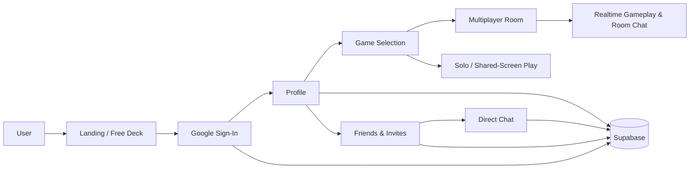

# KnotYet — Social Conversation & Mini-Game Web App

**A little play. A little closer.**

KnotYet is an in-progress social web application designed around conversation, lightweight multiplayer games, and shared activities for two people. It combines relationship-oriented conversation decks, casual mini-games, friend connections, chat, and invite-based play in one browser-based experience.

> **Status:** Deployed for private testing. The project is still being actively tested and refined before a wider public release.

## Why I Built It

The idea behind KnotYet is simple: give two people something better to do together than endlessly scroll.

I defined the product concept, experience, feature set, game ideas, interaction flows, and technical direction. AI-assisted development tools were used to accelerate parts of implementation, while I remained responsible for product decisions, integration, debugging, testing, deployment, and iteration.

## Current Product Experience

Users can:

- Try a public conversation deck without signing in.
- Sign in with Google and maintain a persistent profile.
- Add and connect with another person through invite-based flows.
- Play conversation and guessing games solo, on one device, or through multiplayer rooms.
- Exchange direct messages and game invitations.
- Track profile and gameplay progress.
- Use the application across desktop and mobile layouts.

## Application Flow



## Technology

**Frontend**
- React
- TypeScript
- Vite
- Tailwind CSS
- Framer Motion

**Backend & Data**
- Supabase
- PostgreSQL
- Supabase Auth
- Supabase Realtime

**Realtime / Multiplayer**
- PeerJS / WebRTC
- Invite and room-based multiplayer flows

**Deployment & Analytics**
- Vercel
- Vercel Analytics

## Selected Features

### Authentication & Profiles
- Google OAuth sign-in through Supabase Auth.
- Persistent user profiles and progress.
- Migration logic for earlier browser-local profile/progress data.

### Friend & Invite System
- Invite-based user connection flow.
- Token-validated invite acceptance.
- Friend/contact management and relationship types.
- Account-linked contact state.

### Messaging
- Direct conversations backed by Supabase data.
- Read state and unread counters.
- Message status handling.
- Game invitations inside conversations.

### Multiplayer
- Room-based play for two people.
- Multiplayer waiting rooms and shared game state.
- In-room chat.
- Connection handling and recovery logic.

### Mini-Games
Current game modes include conversation cards and several lightweight competitive/cooperative formats such as:

- Couple Guess
- Number Guesser
- Letter Race
- Couple Match
- This or That
- Secret Number Race
- Spin Wheel activities

## Testing & Reliability Work

Because KnotYet is still in its testing phase, a significant part of the project has focused on validating interaction and delivery behavior rather than only adding features.

Recent testing and fixes have covered:

- Invite acceptance and contact pairing.
- Direct-message delivery and acknowledgement behavior.
- Read/unread state.
- Reconnection and retry flows.
- Multiplayer room messaging.
- Contact removal and re-pairing.
- Responsive UI behavior across desktop and mobile sizes.
- Type checking, build verification, smoke checks, and game review scripts.

The repository includes engineering notes under `docs/` that document selected troubleshooting and redesign work.

## Repository Structure

```text
KnotYet/
├── src/
│   ├── components/     # Games, chat, UI and shared components
│   ├── screens/        # Landing, invite, play, profile and public views
│   ├── store/          # Auth, friends, game and multiplayer state
│   ├── data/           # Questions, choices and localization data
│   ├── utils/          # Invite, storage, game and media helpers
│   └── lib/            # Supabase client and shared services
├── docs/               # Engineering and redesign notes
├── scripts/            # Validation / test utilities
├── public/
├── package.json
└── vercel.json
```

## Run Locally

```bash
npm install
npm run dev
```

Useful checks:

```bash
npm run typecheck
npm run build
npm run smoke
npm run test:games
```

The Supabase project configuration is supplied through environment variables.

## Development Status

KnotYet should currently be treated as a **beta / private-testing project**, not a finished production product. Features, schemas, and interaction flows may continue to change while testing is ongoing.

That status is intentional: the current focus is validating the product experience, reliability, realtime behavior, and edge cases before wider promotion.

---

Built and iterated by **Afiq Amri**.
